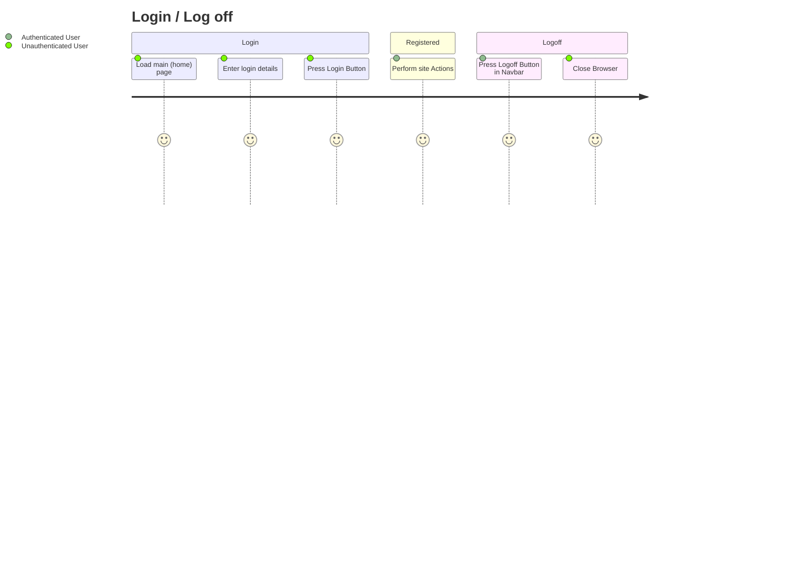
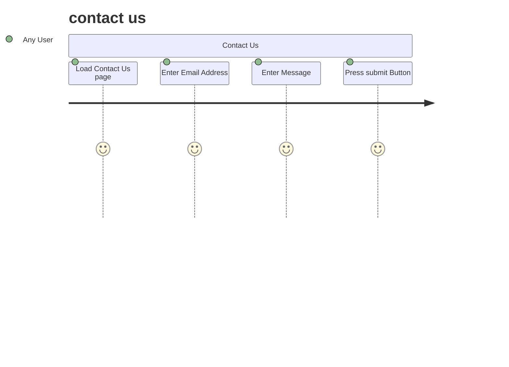

# Project Overview

this php website will be an E-commerce site to sell star-wars comics.

## User Management

Users will be able to log in, log out, reset their passwords, and ether their details.

Users will need to store:

- name
- DOB
- Hashed Password
- Access Level (user vs Administrator)
- Address
- Contact info
- cart items
- purchase history
## Product Management

Administrators will be able to add, remove and edit products.

Products will have

- A name
- A price
- A description
- Quantity
- items in stock

# Behaviour - User Journey

Other behaviours to document
- invoice
- ordering
- admin product add
- admin product edit
- admin product remove
# Planning Diagram - Wireframes

