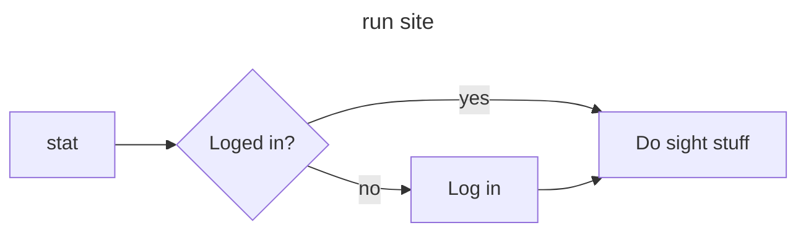
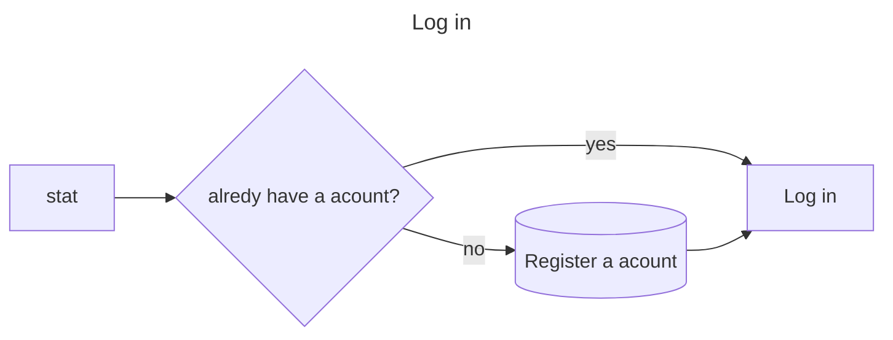
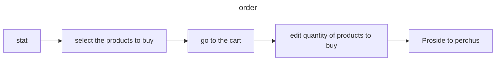
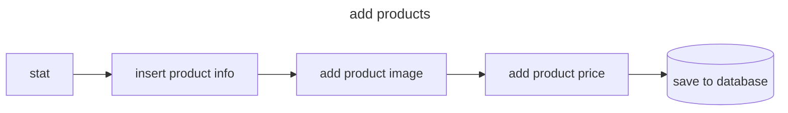
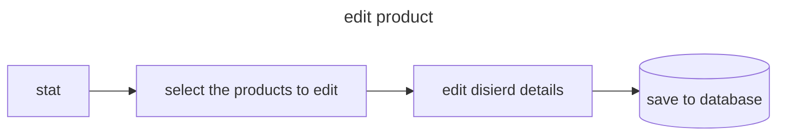

```mermaid
---
title: run site
---
flowchart LR
    A[stat] --> B{Loged in?}
    B -->|yes| D[Do sight stuff]
   B -->|no| E[Log in] --> D
```

```mermaid
---
title: Log in
---
flowchart LR
    A[stat] --> B{alredy have a acount?}
    B -->|yes| D[Log in]
   B -->|no| E[(Register a acount)] --> D
```

```mermaid
---
title: order
---
flowchart LR
    A[stat] --> B[select the products to buy]
    B --> D[go to the cart]
   D --> E[edit quantity of products to buy] 
   E --> F[Proside to perchus]
```
## Admin

```mermaid
---
title: add products
---
flowchart LR
    A[stat] --> B[insert product info]
    B --> D[add product image]
   D --> E[add product price] 
   E --> F[(save to database)]
```

```mermaid
---
title: edit product
---
flowchart LR
    A[stat] --> B[select the products to edit]
    B --> D[edit disierd details]
   D --> E[(save to database)] 
```
